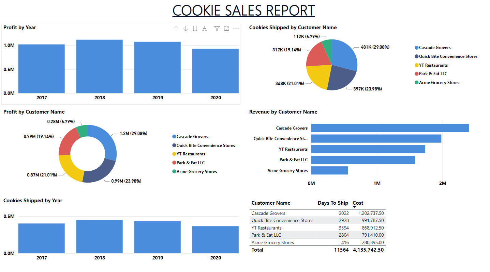

# Cookie Companies' Sales Report

This Power BI report highlights the sales performance of various cookie companies, namely: Cascade Grovers, Quick Bite Convenience Stores, YT Restaurants, Park & Eat LLC, and Acme Grocery Stores.

Moreover, the metrics used to measure their performance are profits, revenue, amount of cookies shipped, and shipping costs.

## Acknowledgements

 - [10 Best Power BI Reports Examples](https://hevodata.com/learn/10-best-power-bi-reports-examples/)
 - [Business Intelligence Reporting](https://www.qlik.com/us/business-intelligence/business-intelligence-reporting)
 - [Sales and Analysis Reports](https://www.clariontech.com/blog/what-are-the-different-types-of-report-in-power-bi)

## Appendix

Cookies are widely popular as a snack all over the globe as they provide required nutritional ingredients such as fats, vitamins, minerals, and other necessary ingredients to the consumer.

Once considered to be an indulgence and luxury for customers, the cookie market has now become an intrinsic part of the biscuit industry. Cookies are flat-baked treats that are consumed as snacks on any occasion.
## Authors

- [@MichaelTobiko](https://github.com/miketobz)

## Screenshots

## Demo

## Features

- Monthly Product Updates (all).
- Extract insights from large datasets (varies)
- Create custom visualizations with R and Python (all)
- Analyze your datasets in Excel (Pro or Premium only)
- Create beautiful maps with your data (all)
- Easily source and transform data with Power Query (all)
- Automatic data refreshes (Pro or Premium only)
- Power BI Mobile App (all)
- Re-use datasets across different reports and dashboards (Pro or Premium only)
- Powerful integration with other Microsoft Products (varies)

## 🔗 Links

# Hi, I'm Michael Tobiko 👋

## 🚀 About Me
I'm a Data Analyst & Innovator.

## 🛠 Skills
Power BI, Python, C++, MySQL, R

